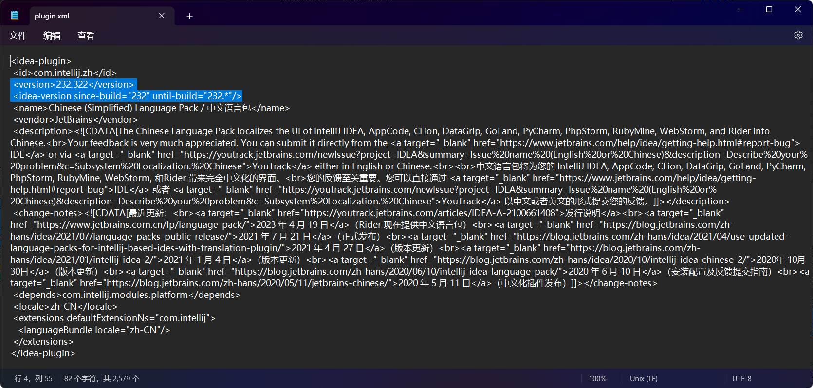

# 中文语言包强改版本号以支持汉化更多jetbrains全家桶和Android Studio软件版本的方法

# 起因
更新了Android Studio最新版
```
Android Studio Ladybug Feature Drop 2024.2.2
内部版本号#AI-242.23726.103.2422.12816248,2024年12月18日构建
```
发现[汉化插件](https://plugins.jetbrains.com/plugin/13710-chinese-simplified-language-pack----/versions)尚不支持此版本  

尝试修改版本号，发现确实管用。

# 步骤
1. 先去[汉化插件](https://plugins.jetbrains.com/plugin/13710-chinese-simplified-language-pack----/versions)页面下载最新的压缩包，使用本仓库的[zh.232.322.zip](zh.232.322.zip)也可。
2. 使用[bandizip](https://cn.bandisoft.com/bandizip/)等解压软件解压此压缩包。目录如[zh.232.322](./zh.232.322/zh.232.322/)所示。
3. 使用[bandizip](https://cn.bandisoft.com/bandizip/)等解压软件查看`lib`目录下的jar文件，不要解压，直接打开查看。

4. 选中`META-INF`目录，右击`plugin.xml`文件，选择`编辑`。

5. 编辑第三行和第四行的版本号，将其修改为你所安装的开发软件的版本号，可打开你的开发软件的关于页面看到版本号



6. 快捷键`ctrl+s`保存. 关闭记事本并在弹出的对话框中将修改保存进压缩包

7. 将文件及目录重命名一下，退出插件目录，将插件目录重新压缩成zip文件，仔细看截图路径，下一级目录直接是插件文件。


8. 在开发软件里安装此压缩包


9. 在开发软件设置中文，然后重启软件完成汉化

